
# Areas of Crime in our Nation's Capital

Being a resident of our nation’s capital, I was curious to learn more about the city. I was not looking for anything in particular, just curious. I started with viewing the Wikipedia. Learning about the history, architecture, culture, population, among other things. Being that Washington DC is the capital, there is no shortage of unique information. 

I was also curious on how to build an interactive map. Something of a challenge to myself. Then I got the idea to use the city’s demographics (population, income, home value, etc.) and with power of the Folium library, build a choropleth map to visually see the differences. I included crime data as well, specifically violent gun-related crime, and noticed a very distinctive trend. Areas where there are high income, high home value, and high education had almost no violent crime. I had to learn more and find out if there are other demographics that contribute to violent crime.

__Questions__
1.	Building a choropleth map, can we find a “boundary” which separates crime from non-crime?
2.	Can we predict if a particular area (census district) will be high in violent gun-related crimes?

__(note, throughout this notebook, any mention of the word crime specifically means violent gun-related crime)__

Here is how I tackled the problem 
-	Research what contributes to crime
-	Grab demographic data from the US Census 
-	Build a model that can predict if a particular area is susceptible to violent crime

During my research, the following factors kept coming up: education, employment, and income. I was curious though if other factors contribute to crime as well. Navigating the US Census database, I pulled the following information: population, income, home value, marital status, education level, employment status, access to a car, and veteran status. 

After running the data through my model, I found that certain factors are in fact correlated with violent crime, with the two most being education and marital status. Further research is needed to explain why (and beyond the scope of this particular project), however this makes sense as education provides an opportunity for employment (or better employment) which leads to higher income. Marital status is interesting and I can only speculate why. Perhaps with two sources of income, the “need” to commit crime doesn’t exist? Alternatively, it can be more psychological: the potential of being separated by one’s partner? Whatever the cause, further research is needed.

The objective of DC’s city council is to govern the city, provide a safe environment, and help foster a well-connected community. The information I provided can help city council to understand what factors contribute to violent crime. With my findings, I recommend that city council invest in public schools with a goal to push students towards pursuing higher education, and for police officers to patrol areas with the highest amount of violent crime. 

This project is not over. As I mentioned, further research is needed to understand why areas with high education and a higher percentage of married couples decrease violent crime. 

Links to the research are listed at the bottom.


# Building a Choropleth Map


```python
# import libraies
import pandas as pd
import numpy as np
import os
import json
import folium
import matplotlib.pyplot as plt
%matplotlib inline
import geopandas as gpd
import seaborn as sns
current_palette = sns.color_palette()
sns.palplot(current_palette)
```


First, I need to read the Shapfile provided by the US Census and convert it to a geojson file.


```python
# read and view the US Census shapefile for DC. This provides the coordinates for the DC census boundaries 
file = os.path.join('dc_census_track/', 'cb_2017_11_tract_500k.shp')
shapefile = gpd.read_file(file)
print(type(shapefile))
shapefile.head()
```

    <class 'geopandas.geodataframe.GeoDataFrame'>
    


<div>
<style scoped>
    .dataframe tbody tr th:only-of-type {
        vertical-align: middle;
    }

    .dataframe tbody tr th {
        vertical-align: top;
    }

    .dataframe thead th {
        text-align: right;
    }
</style>
<table border="1" class="dataframe">
  <thead>
    <tr style="text-align: right;">
      <th></th>
      <th>STATEFP</th>
      <th>COUNTYFP</th>
      <th>TRACTCE</th>
      <th>AFFGEOID</th>
      <th>GEOID</th>
      <th>NAME</th>
      <th>LSAD</th>
      <th>ALAND</th>
      <th>AWATER</th>
      <th>geometry</th>
    </tr>
  </thead>
  <tbody>
    <tr>
      <th>0</th>
      <td>11</td>
      <td>001</td>
      <td>000400</td>
      <td>1400000US11001000400</td>
      <td>11001000400</td>
      <td>4</td>
      <td>CT</td>
      <td>1542760</td>
      <td>69</td>
      <td>POLYGON ((-77.07316399999999 38.923051, -77.07...</td>
    </tr>
    <tr>
      <th>1</th>
      <td>11</td>
      <td>001</td>
      <td>000600</td>
      <td>1400000US11001000600</td>
      <td>11001000600</td>
      <td>6</td>
      <td>CT</td>
      <td>1442822</td>
      <td>71</td>
      <td>POLYGON ((-77.07650699999999 38.94221599999999...</td>
    </tr>
    <tr>
      <th>2</th>
      <td>11</td>
      <td>001</td>
      <td>002102</td>
      <td>1400000US11001002102</td>
      <td>11001002102</td>
      <td>21.02</td>
      <td>CT</td>
      <td>726388</td>
      <td>0</td>
      <td>POLYGON ((-77.019897 38.958733, -77.0134219999...</td>
    </tr>
    <tr>
      <th>3</th>
      <td>11</td>
      <td>001</td>
      <td>004201</td>
      <td>1400000US11001004201</td>
      <td>11001004201</td>
      <td>42.01</td>
      <td>CT</td>
      <td>204529</td>
      <td>0</td>
      <td>POLYGON ((-77.041656 38.91678, -77.041224 38.9...</td>
    </tr>
    <tr>
      <th>4</th>
      <td>11</td>
      <td>001</td>
      <td>004902</td>
      <td>1400000US11001004902</td>
      <td>11001004902</td>
      <td>49.02</td>
      <td>CT</td>
      <td>263884</td>
      <td>0</td>
      <td>POLYGON ((-77.02703699999999 38.90564699999999...</td>
    </tr>
  </tbody>
</table>
</div>


```python
# check if DC with all it's census boundries are displayed 
print(shapefile.plot()) # correctly prints the census boundaries
print(shapefile.plot(column='ALAND')) # testing the choropleth map
```

    AxesSubplot(0.2523,0.125;0.5204x0.755)
    AxesSubplot(0.2523,0.125;0.5204x0.755)
    


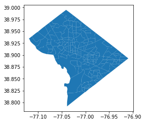


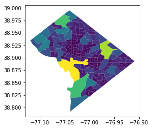


Great, it works.

Note .txt is an extension and json is the data format. in order to convert anything to json there has to be some sort of relation like key-value pair, table-column etc.. an unstructured text file can not be directly converted to json format


```python
# convert the GeoDataFrame shapefile to a json format
shapefile_json = shapefile.to_json()
#type(shapefile_json) # prints out a str

parsed = json.loads(shapefile_json)
#print(json.dumps(parsed, indent=4, sort_keys=True)) #this prettyprints the json

# saving the str file to geojson
with open('geo_data.json', 'w') as f:
    json.dump(parsed, f, indent=4, sort_keys=True, )
f.close()

geo_data = json.load(open('geo_data.json'))
```


```python
print(type(geo_data)) # prints class 'dict'
print(geo_data.keys()) # two keys: 'features' and 'type'
print(geo_data['type'])
print(geo_data['features'][0])
```

    <class 'dict'>
    dict_keys(['features', 'type'])
    FeatureCollection
    {'geometry': {'coordinates': [[[-77.07316399999999, 38.923051], [-77.073188, 38.926182], [-77.073162, 38.928611], [-77.07265, 38.931871], [-77.06639, 38.931467], [-77.066384, 38.927527], [-77.06324, 38.92752], [-77.057718, 38.923213], [-77.056079, 38.923283999999995], [-77.05403799999999, 38.921182], [-77.05695399999999, 38.920257], [-77.05653199999999, 38.919523], [-77.059084, 38.918313], [-77.063824, 38.918445999999996], [-77.06689399999999, 38.918656], [-77.067388, 38.917759], [-77.068752, 38.916965999999995], [-77.06938199999999, 38.917725999999995], [-77.07147599999999, 38.920187999999996], [-77.072907, 38.922543], [-77.073195, 38.922543999999995], [-77.07316399999999, 38.923051]]], 'type': 'Polygon'}, 'id': '0', 'properties': {'AFFGEOID': '1400000US11001000400', 'ALAND': 1542760, 'AWATER': 69, 'COUNTYFP': '001', 'GEOID': '11001000400', 'LSAD': 'CT', 'NAME': '4', 'STATEFP': '11', 'TRACTCE': '000400'}, 'type': 'Feature'}
    

__In order for the folium choropleth map to work, both the geo_json file (which holds the boundaries) and the data_file (which holds the data values) need to match for a particular column. In other words, both columns need to be identical in terms of data type and value.__


```python
# replace all 'id' values to 'geoid' values
for feature in geo_data['features']:
    #geoid.append(feature['properties']['GEOID'])
    #print(feature['id'])
    feature['id'] = feature['properties']['GEOID']
    #print(feature['geometry']['coordinates'])
```


```python
# confirm if the 'id' values have been replaced
print(geo_data['features'][1])
```

    {'geometry': {'coordinates': [[[-77.07650699999999, 38.942215999999995], [-77.06887499999999, 38.942209999999996], [-77.067852, 38.940875999999996], [-77.06513199999999, 38.940475], [-77.06165399999999, 38.940971999999995], [-77.061517, 38.940735], [-77.059243, 38.936824], [-77.05677, 38.93257], [-77.059874, 38.930394], [-77.063254, 38.930509], [-77.064679, 38.931069], [-77.06639, 38.931467], [-77.07265, 38.931871], [-77.07241499999999, 38.933484], [-77.07250499999999, 38.934636], [-77.075037, 38.939544999999995], [-77.07650699999999, 38.942215999999995]]], 'type': 'Polygon'}, 'id': '11001000600', 'properties': {'AFFGEOID': '1400000US11001000600', 'ALAND': 1442822, 'AWATER': 71, 'COUNTYFP': '001', 'GEOID': '11001000600', 'LSAD': 'CT', 'NAME': '6', 'STATEFP': '11', 'TRACTCE': '000600'}, 'type': 'Feature'}
    

Great. I was able to change the `feature.id` values to the `GEOID` values.

## Bringing in the data

The following data was pulled from the US Census (a great resource). I used Excel to combine all the data into one file. The `GEOID2` column is the unique number assigned to an individual census district. This is the column I will match with my geojson file.


```python
dc_2017 = pd.read_csv('dc_data_2017.csv')
dc_2017.head()
```


<div>
<style scoped>
    .dataframe tbody tr th:only-of-type {
        vertical-align: middle;
    }

    .dataframe tbody tr th {
        vertical-align: top;
    }

    .dataframe thead th {
        text-align: right;
    }
</style>
<table border="1" class="dataframe">
  <thead>
    <tr style="text-align: right;">
      <th></th>
      <th>OBJECTID</th>
      <th>TRACT</th>
      <th>GEO</th>
      <th>GEOID2</th>
      <th>GEO_display_label</th>
      <th>Population</th>
      <th>Income</th>
      <th>Home_value</th>
      <th>No_car_percent</th>
      <th>Bachelor_or_higher</th>
      <th>Employment_percent</th>
      <th>Marital_percent</th>
      <th>Veterans_percent</th>
    </tr>
  </thead>
  <tbody>
    <tr>
      <th>0</th>
      <td>11</td>
      <td>100</td>
      <td>1400000US11001000100</td>
      <td>11001000100</td>
      <td>Census Tract 1, District of Columbia, District...</td>
      <td>5170</td>
      <td>168477.0</td>
      <td>1048200.0</td>
      <td>0.181</td>
      <td>0.9129</td>
      <td>0.754</td>
      <td>0.489</td>
      <td>0.082</td>
    </tr>
    <tr>
      <th>1</th>
      <td>12</td>
      <td>201</td>
      <td>1400000US11001000201</td>
      <td>11001000201</td>
      <td>Census Tract 2.01, District of Columbia, Distr...</td>
      <td>3682</td>
      <td>NaN</td>
      <td>NaN</td>
      <td>NaN</td>
      <td>1.0000</td>
      <td>0.393</td>
      <td>0.010</td>
      <td>NaN</td>
    </tr>
    <tr>
      <th>2</th>
      <td>13</td>
      <td>202</td>
      <td>1400000US11001000202</td>
      <td>11001000202</td>
      <td>Census Tract 2.02, District of Columbia, Distr...</td>
      <td>4473</td>
      <td>162981.0</td>
      <td>1195300.0</td>
      <td>0.168</td>
      <td>0.9264</td>
      <td>0.641</td>
      <td>0.305</td>
      <td>0.035</td>
    </tr>
    <tr>
      <th>3</th>
      <td>14</td>
      <td>300</td>
      <td>1400000US11001000300</td>
      <td>11001000300</td>
      <td>Census Tract 3, District of Columbia, District...</td>
      <td>6374</td>
      <td>133008.0</td>
      <td>893000.0</td>
      <td>0.160</td>
      <td>0.8909</td>
      <td>0.794</td>
      <td>0.313</td>
      <td>0.021</td>
    </tr>
    <tr>
      <th>4</th>
      <td>15</td>
      <td>400</td>
      <td>1400000US11001000400</td>
      <td>11001000400</td>
      <td>Census Tract 4, District of Columbia, District...</td>
      <td>1489</td>
      <td>143229.0</td>
      <td>1223700.0</td>
      <td>0.120</td>
      <td>0.7906</td>
      <td>0.617</td>
      <td>0.497</td>
      <td>0.044</td>
    </tr>
  </tbody>
</table>
</div>


```python
dc_2017.info()
```

    <class 'pandas.core.frame.DataFrame'>
    RangeIndex: 179 entries, 0 to 178
    Data columns (total 13 columns):
    OBJECTID              179 non-null int64
    TRACT                 179 non-null int64
    GEO                   179 non-null object
    GEOID2                179 non-null int64
    GEO_display_label     179 non-null object
    Population            179 non-null int64
    Income                177 non-null float64
    Home_value            172 non-null float64
    No_car_percent        175 non-null float64
    Bachelor_or_higher    178 non-null float64
    Employment_percent    178 non-null float64
    Marital_percent       178 non-null float64
    Veterans_percent      177 non-null float64
    dtypes: float64(7), int64(4), object(2)
    memory usage: 18.3+ KB
    

I need to rename the 'GEOID2' column to 'GEOID' and change the data type to a str so it can match with the geo_json file


```python
dc_2017.rename(columns={'GEO': 'GEOMAIN', 'GEOID2': 'GEOID'}, inplace=True)
dc_2017['GEOID'] = dc_2017['GEOID'].astype(str)

#dc_2010['Home_value'] = dc_2010['Home_value'].str.replace(',', '')
#dc_2010['Home_value'] = dc_2010['Home_value'].astype(float)
```


```python
dc_2017.info()
```

    <class 'pandas.core.frame.DataFrame'>
    RangeIndex: 179 entries, 0 to 178
    Data columns (total 13 columns):
    OBJECTID              179 non-null int64
    TRACT                 179 non-null int64
    GEOMAIN               179 non-null object
    GEOID                 179 non-null object
    GEO_display_label     179 non-null object
    Population            179 non-null int64
    Income                177 non-null float64
    Home_value            172 non-null float64
    No_car_percent        175 non-null float64
    Bachelor_or_higher    178 non-null float64
    Employment_percent    178 non-null float64
    Marital_percent       178 non-null float64
    Veterans_percent      177 non-null float64
    dtypes: float64(7), int64(3), object(3)
    memory usage: 18.3+ KB
    

Change is successful.

## The actual building of the Choropleth map

First, I'll build a map with just the census boundaries to verify that my geojson file is formatted correctly.


```python
# create the folium object
m = folium.Map(location=[38.9072, -77.0369], zoom_start=12)

folium.Choropleth(geo_data=geo_data).add_to(m)

m.save(os.path.join('maps', 'dc_map_2017_1.html'))
```


Great, it works.

Now to add the data.


```python
# create the folium object
m = folium.Map(location=[38.9072, -77.0369], zoom_start=12)

# population
folium.Choropleth(
    geo_data=geo_data,
    name='Population',
    data=dc_2017,
    columns=['GEOID', 'Population'],
    key_on='feature.id', # the information from both files need to match EXACTLY (value and type (str or int)) 
    fill_color='PuBu',
    legend_name='Population', # cannot remove the legend
    overlay=True,
    show=False
).add_to(m)

# income
folium.Choropleth(
    geo_data=geo_data,
    name='Income',
    data=dc_2017,
    columns=['GEOID', 'Income'],
    key_on='feature.id',
    fill_color='PuBu',
    legend_name='Income',
    overlay=True,
    show=False
).add_to(m)

# home value
folium.Choropleth(
    geo_data=geo_data,
    name='Home Value',
    data=dc_2017,
    columns=['GEOID', 'Home_value'],
    key_on='feature.id',
    fill_color='PuBu',
    legend_name='Home Value',
    overlay=True,
    show=False
).add_to(m)

# education
folium.Choropleth(
    geo_data=geo_data,
    name='Bachelors or Higher (%)',
    data=dc_2017,
    columns=['GEOID', 'Bachelor_or_higher'],
    key_on='feature.id',
    fill_color='PuBu',
    legend_name='Percent of Bachelor or Higher',
    overlayer=True,
    show=False
).add_to(m)

# employment
folium.Choropleth(
    geo_data=geo_data,
    name='Employment (%)',
    data=dc_2017,
    columns=['GEOID', 'Employment_percent'],
    key_on='feature.id',
    fill_color='PuBu',
    legend_name='Percent of Employment',
    overlay=True,
    show=False
).add_to(m)

# marital status
folium.Choropleth(
    geo_data=geo_data,
    name='Married (%)',
    data=dc_2017,
    columns=['GEOID', 'Marital_percent'],
    key_on='feature.id',
    fill_color='PuBu',
    legend_name='Percent of Married Household',
    overlay=True,
    show=False
).add_to(m)

# veteran status
folium.Choropleth(
    geo_data=geo_data,
    name='Veteran (%)',
    data=dc_2017,
    columns=['GEOID', 'Veterans_percent'],
    key_on='feature.id',
    fill_color='PuBu',
    legend_name='Percent of Veterans',
    overlay=True,
    show=False
).add_to(m)

#folium.LayerControl(collapsed=False).add_to(m)


m.save(os.path.join('maps', 'dc_map_2017_2.html'))
```


Great! The choropleth maps works with all the data shadded. Unfortunately, the legend seems to be in the way and it cannot (or I just can't figure it out) be removed.

## Adding Markers for Historic Landmarks

What's a map of DC without all the historic landmarks which it's famous for. Using Yelp's API, I saved landmarks with their coordinates. Each landmark will be a Folium marker.


```python
# create an icon for each landmark
landmark = pd.read_csv('landmarks.csv')
landmark.drop(columns=['Unnamed: 0'], inplace=True)
landmark.drop(landmark.index[[0,1,2]], inplace=True)
landmark.head()
```


<div>
<style scoped>
    .dataframe tbody tr th:only-of-type {
        vertical-align: middle;
    }

    .dataframe tbody tr th {
        vertical-align: top;
    }

    .dataframe thead th {
        text-align: right;
    }
</style>
<table border="1" class="dataframe">
  <thead>
    <tr style="text-align: right;">
      <th></th>
      <th>Name</th>
      <th>Lat</th>
      <th>Lon</th>
    </tr>
  </thead>
  <tbody>
    <tr>
      <th>3</th>
      <td>Library of Congress</td>
      <td>38.888733</td>
      <td>-77.004502</td>
    </tr>
    <tr>
      <th>4</th>
      <td>Lincoln Memorial</td>
      <td>38.889346</td>
      <td>-77.050200</td>
    </tr>
    <tr>
      <th>5</th>
      <td>United States Capitol</td>
      <td>38.891450</td>
      <td>-77.012170</td>
    </tr>
    <tr>
      <th>6</th>
      <td>Washington Monument</td>
      <td>38.889576</td>
      <td>-77.035258</td>
    </tr>
    <tr>
      <th>7</th>
      <td>Thomas Jefferson Memorial</td>
      <td>38.881423</td>
      <td>-77.036487</td>
    </tr>
  </tbody>
</table>
</div>


```python
# using market cluster to make the markers easier to read
# note, you have to pass a list to `locations=` cannot do `locations=[lat,lon]`
from folium.plugins import MarkerCluster

#m = folium.Map(location=[38.9072, -77.0369], zoom_start=12)

names = landmark['Name']
lats = landmark['Lat']
lons = landmark['Lon']

marker_cluster = MarkerCluster(name='National Landmarks', show=False).add_to(m)

for name, lat, lon in zip(names, lats, lons):
    folium.Marker(location=[lat, lon],
                  popup=name,
                  icon=folium.Icon(color='green')).add_to(marker_cluster) # each marker is added to `marker_cluster` object
    marker_cluster.add_to(m) # each marker_cluster is added to the map

#folium.LayerControl(collapsed=False).add_to(m)

m.save(os.path.join('maps', 'dc_map_2017_3.html'))
```


## Adding a Heatmap for Violent Crime 

Now I'll add the crime data as a heatmap.


```python
crime = pd.read_csv('crime.csv')
crime.info()
```

    <class 'pandas.core.frame.DataFrame'>
    RangeIndex: 1584 entries, 0 to 1583
    Data columns (total 3 columns):
    offense_text    1584 non-null object
    LONGITUDE       1584 non-null float64
    LATITUDE        1584 non-null float64
    dtypes: float64(2), object(1)
    memory usage: 37.2+ KB
    


```python
crime_loc = list(zip(crime['LATITUDE'], crime['LONGITUDE']))
crime_loc[0]
```


    (38.94133373, -77.02538826)


```python
# note, need to give it a list of lat, lon, i.e a list of lists. also no NaN
# ex: [[lat, lon],[lat, lon],[lat, lon],[lat, lon],[lat, lon]]
# must also be a type float

from folium import plugins
from folium.plugins import HeatMap

# List comprehension to make out list of lists
crime_loc = list(zip(crime['LATITUDE'], crime['LONGITUDE']))
# print(crime_loc[0])

#m = folium.Map(location=[38.9072, -77.0369], zoom_start=12)

# Plot it on the map
HeatMap(data=crime_loc,
        name='Violent Crime',
        control=True,
        show=False).add_to(m)

folium.LayerControl(collapsed=False).add_to(m) # the LayerControl must be added to the last layer

m.save(os.path.join('maps', 'dc_map_2017_4.html'))
```


The heatmap works and interesting enough, there seems to be an area in DC where violent crime is absent. Let's explore more of the crime data.

# Exploratory Data Analysis

DC Police have created an interactive web app called [DC Crime Card](https://dcatlas.dcgis.dc.gov/crimecards/), which provides the capability to search for specific kinds of crimes and visual them as hotspots. Not all crime is related. There is a significant difference between jaywalking and littering to rape and murder. For this analysis, I narrowed my search for all violent gun-related crimes that occurred in 2017. A total of 1,574 incidents were reported.


```python
import seaborn as sns
import matplotlib.pyplot as plt
import numpy as np
sns.set()
current_palette = sns.color_palette()
sns.palplot(current_palette)
plt.rcParams['figure.figsize'] = (12.0, 10.0)
```


```python
# joining the file
file = os.path.join('data/', 'crime', 'crime_full.csv')
crime_df = pd.read_csv(file)

# viewing and understanding the data types for each column
crime_df.head()
#crime_df.info()
```


<div>
<style scoped>
    .dataframe tbody tr th:only-of-type {
        vertical-align: middle;
    }

    .dataframe tbody tr th {
        vertical-align: top;
    }

    .dataframe thead th {
        text-align: right;
    }
</style>
<table border="1" class="dataframe">
  <thead>
    <tr style="text-align: right;">
      <th></th>
      <th>NEIGHBORHOOD_CLUSTER</th>
      <th>CENSUS_TRACT</th>
      <th>offensegroup</th>
      <th>LONGITUDE</th>
      <th>END_DATE</th>
      <th>offense-text</th>
      <th>SHIFT</th>
      <th>YBLOCK</th>
      <th>DISTRICT</th>
      <th>WARD</th>
      <th>...</th>
      <th>BLOCK</th>
      <th>START_DATE</th>
      <th>CCN</th>
      <th>OFFENSE</th>
      <th>OCTO_RECORD_ID</th>
      <th>ANC</th>
      <th>REPORT_DAT</th>
      <th>METHOD</th>
      <th>location</th>
      <th>LATITUDE</th>
    </tr>
  </thead>
  <tbody>
    <tr>
      <th>0</th>
      <td>cluster 22</td>
      <td>11100.0</td>
      <td>violent</td>
      <td>-76.974191</td>
      <td>2017-11-13T11:35:34.000</td>
      <td>robbery</td>
      <td>day</td>
      <td>139566</td>
      <td>5</td>
      <td>5</td>
      <td>...</td>
      <td>2600 - 2699 block of 22nd street ne</td>
      <td>2017-11-13T10:35:32.000</td>
      <td>17196635</td>
      <td>robbery</td>
      <td>17196635-01</td>
      <td>5C</td>
      <td>2017-11-13T16:35:36.000Z</td>
      <td>gun</td>
      <td>38.923973417948297,-76.974193510301745</td>
      <td>38.923966</td>
    </tr>
    <tr>
      <th>1</th>
      <td>cluster 31</td>
      <td>7809.0</td>
      <td>violent</td>
      <td>-76.927129</td>
      <td>2017-11-17T22:57:16.000</td>
      <td>assault w/dangerous weapon</td>
      <td>evening</td>
      <td>136994</td>
      <td>6</td>
      <td>7</td>
      <td>...</td>
      <td>800 - 899 block of 51st street ne</td>
      <td>2017-11-17T20:08:53.000</td>
      <td>17199382</td>
      <td>assault w/dangerous weapon</td>
      <td>17199382-01</td>
      <td>7C</td>
      <td>2017-11-18T03:57:39.000Z</td>
      <td>gun</td>
      <td>38.900784092272893,-76.927131753204847</td>
      <td>38.900776</td>
    </tr>
    <tr>
      <th>2</th>
      <td>cluster 22</td>
      <td>9102.0</td>
      <td>violent</td>
      <td>-76.984881</td>
      <td>2017-11-17T22:45:01.000</td>
      <td>assault w/dangerous weapon</td>
      <td>midnight</td>
      <td>139563</td>
      <td>5</td>
      <td>5</td>
      <td>...</td>
      <td>1400 - 1424 block of montana avenue ne</td>
      <td>2017-11-17T22:41:13.000</td>
      <td>17199489</td>
      <td>assault w/dangerous weapon</td>
      <td>17199489-01</td>
      <td>5C</td>
      <td>2017-11-18T07:01:11.000Z</td>
      <td>gun</td>
      <td>38.923948264522402,-76.984883745500071</td>
      <td>38.923940</td>
    </tr>
    <tr>
      <th>3</th>
      <td>cluster 17</td>
      <td>1803.0</td>
      <td>violent</td>
      <td>-77.036383</td>
      <td>2017-09-21T01:45:23.000</td>
      <td>robbery</td>
      <td>day</td>
      <td>144379</td>
      <td>4</td>
      <td>4</td>
      <td>...</td>
      <td>6314  - 6399 block of 16th street nw</td>
      <td>2017-09-21T01:40:07.000</td>
      <td>17163823</td>
      <td>robbery</td>
      <td>17163823-01</td>
      <td>4A</td>
      <td>2017-09-21T13:58:32.000Z</td>
      <td>gun</td>
      <td>38.967327474290151,-77.036385027160023</td>
      <td>38.967320</td>
    </tr>
    <tr>
      <th>4</th>
      <td>cluster 21</td>
      <td>3400.0</td>
      <td>violent</td>
      <td>-77.015013</td>
      <td>2017-10-25T00:27:59.000</td>
      <td>robbery</td>
      <td>midnight</td>
      <td>138541</td>
      <td>3</td>
      <td>1</td>
      <td>...</td>
      <td>200 - 299 block of rhode island avenue nw</td>
      <td>2017-10-25T00:25:15.000</td>
      <td>17185001</td>
      <td>robbery</td>
      <td>17185001-01</td>
      <td>1B</td>
      <td>2017-10-25T08:00:34.000Z</td>
      <td>gun</td>
      <td>38.914741765118478,-77.015015097113633</td>
      <td>38.914734</td>
    </tr>
  </tbody>
</table>
<p>5 rows × 29 columns</p>
</div>


Let's convert the start date to datetime format so we can get a sense of the crime committed per month and week. The `crime_df['START_DATE']` column is formatted as Year, month, date, time. However, there is a `T` between date and time. I'll replace the `T` with a space and then format it correctly. I'll also remove the microseconds.

`crime_df['CENSUS_TRACT']` will be converted to an int type and padded with the correct GEO code so it can be paired with the GEOJSON file
- if 3 digits: add 11001000
- if 4 digits: add 1100100
- if 5 digits: add 110010


```python
crime_df['START_DATE'] = crime_df['START_DATE'].str.replace('T', ' ').str.replace('.000', '')
crime_df['START_DATE'] = pd.to_datetime(crime_df['START_DATE'], format='%Y-%m-%d %H:%M:%S')

crime_df['CENSUS_TRACT'] = crime_df['CENSUS_TRACT'].fillna(0)
crime_df['CENSUS_TRACT'] = crime_df['CENSUS_TRACT'].astype(int) # converted to int so remove he .0 decimal 

crime_df['CENSUS_TRACT'] = crime_df['CENSUS_TRACT'].astype(str) # converted to str so i can pad the digits needed
#crime_df['CENSUS_TRACT'] = crime_df['CENSUS_TRACT'].str.rjust(11, '110010')
#len(crime_df['CENSUS_TRACT'][0])

new_list =[]
for i in crime_df['CENSUS_TRACT']:
    if len(i) == 3:
        i='11001000'+i
    if len(i) == 4:
        i='1100100'+i
    if len(i) == 5:
        i='110010'+i
    new_list.append(i)

#print(new_list)
crime_df['CENSUS_TRACT'] = new_list
#crime_df['CENSUS_TRACT'] = crime_df['CENSUS_TRACT'].astype(str)
```


```python
# verify
# crime_df.info()
```

I'll create a new `Month` and `Weekday` column to analyze when crimes occur.


```python
import calendar

crime_df['Month'] = (crime_df['START_DATE'].dt.month).apply(lambda x: calendar.month_abbr[x])
crime_df['Month'] = pd.Categorical(crime_df['Month'], categories=['Jan', 'Feb', 'Mar', 'Apr', 'May', 'Jun', 'Jul', 'Aug', 
                                                                  'Sep', 'Oct', 'Nov', 'Dec'], ordered=True)

crime_df['Weekday'] = crime_df['START_DATE'].dt.weekday_name
crime_df['Weekday'] = pd.Categorical(crime_df['Weekday'], categories=['Monday', 'Tuesday', 'Wednesday', 'Thursday', 
                                                                      'Friday', 'Saturday', 'Sunday'], ordered=True)
```

Now that I have `Month` and `Weekday` columns, I can start the exploring.

## Let's explore the data

### Number of crimes reported each month


```python
sns.countplot(x='Month', data=crime_df)
plt.ylabel('Number of Crimes')
plt.show()
```


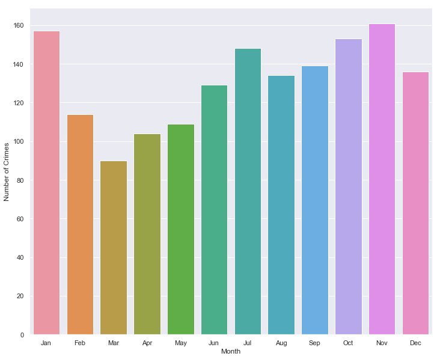


```python
month = ['Jan', 'Feb', 'Mar', 'Apr', 'May', 'Jun', 'Jul', 'Aug', 'Sep', 'Oct', 'Nov', 'Dec']
crime_df.groupby('Month')['CENSUS_TRACT'].count().plot(marker='o')
plt.xticks(np.arange(12), month)
plt.ylabel('Number of Crimes')
plt.show()
```


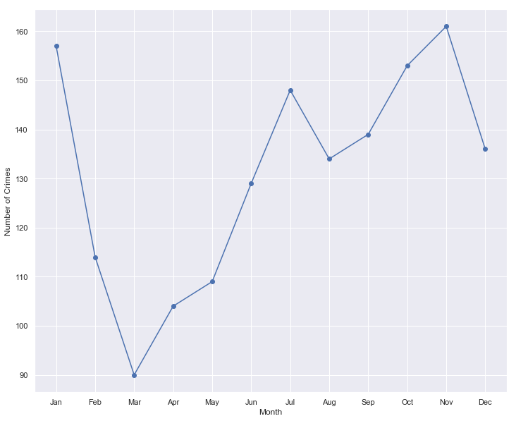


Crime seems to decrease during the winter months with the lowest point in March. Around May, it starts to increase with a peack in November.


```python
sns.countplot(x='Weekday', data=crime_df)
plt.ylabel('Number of Crimes')
plt.show()
```


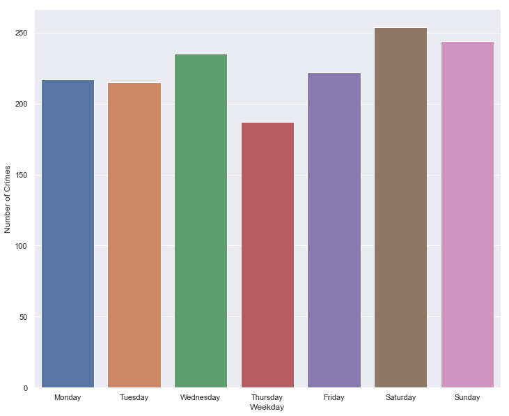


```python
weekday = ['Monday', 'Tuesday', 'Wednesday', 'Thursday', 'Friday', 'Saturday', 'Sunday']
crime_df.groupby('Weekday')['CENSUS_TRACT'].count().plot(marker='o')
plt.xticks(np.arange(7), weekday)
plt.ylabel('Number of Crimes')
plt.show()
```


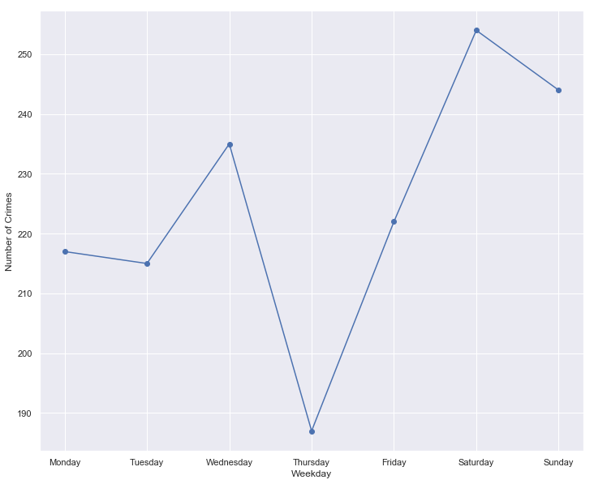


Thursday's see the lowest crime incidents while the weekend (with a peak on Saturday) see the highest.

### Time of day violent crimes occur


```python
sns.countplot(x='SHIFT', data=crime_df)
plt.ylabel('Number of Crimes')
plt.show()
```


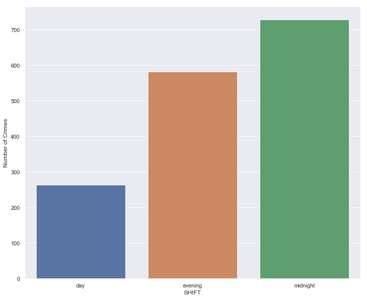


Violent crimes tend to occur in the evening to midnight time (passed 5pm)

### Now I'll analyze where violent crimes occur


```python
#crime_df['CENSUS_TRACT'].value_counts()
crime_df['CENSUS_TRACT'].nunique()
```


    166


```python
location = crime_df['CENSUS_TRACT'].value_counts()
#type(location)

#location = crime_df.groupby('CENSUS_TRACT').count().sort_values(ascending=False)
location = location[:30] # only want the top 25
#location

location.plot(kind='bar', figsize=(15,5))
plt.xlabel('Census Tract')
plt.ylabel('Number of Crimes')
plt.show()
```


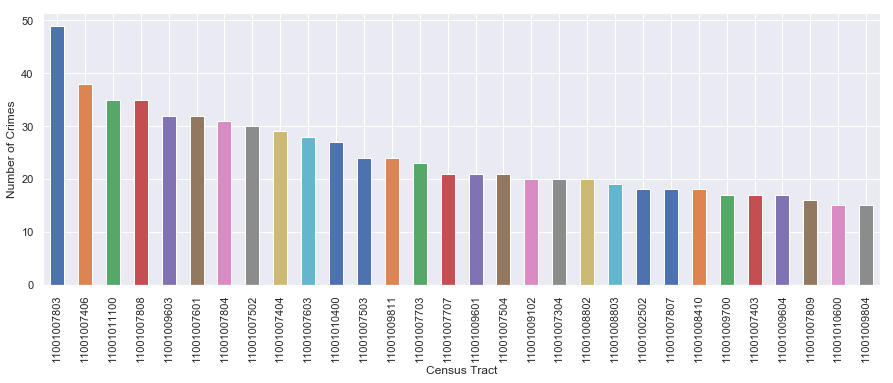


The census tracts provide a granular area of DC (there over 170 tracts). This is great when trying to narrow pockets of crime. However, the DC government divides DC into 8 separate areas called Wards. Let’s analyze crime based on Wards. 


```python
sns.countplot(x='WARD', data=crime_df)
plt.ylabel('Number of Crimes')
plt.show()
```


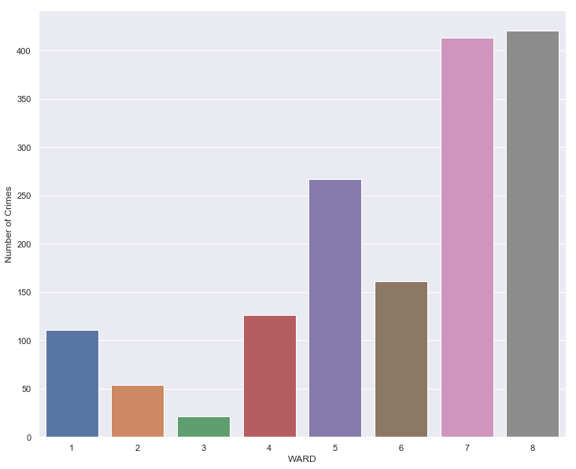


Most of the violent crimes are committed in DC are in Wards 7 and 8.

### Analyzing the shift of day for each Ward


```python
crime_df.groupby(['WARD', 'SHIFT'])['CENSUS_TRACT'].count().plot(kind='bar', figsize=(15,5))
plt.ylabel('Number of Crime')
plt.show()
```


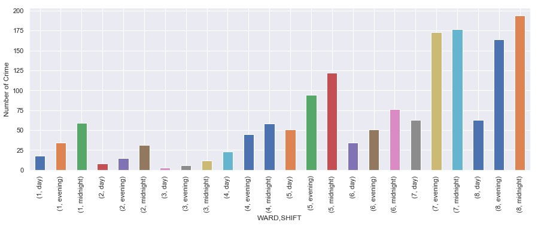


Even though most violent crimes occurs in Ward 7 and 8, most of the crimes occur during the evening and midnight.

The goal is to try to build a model that can predict if a violent crime will occur based on census tract characteristics. I will count the number of crimes occurred for each census and merge it with the dc_data_2017.csv file.


```python
location = crime_df['CENSUS_TRACT'].value_counts()
#crime_df['Count'] = location
type(location)
#location
```


    pandas.core.series.Series


```python
temp = pd.DataFrame()
temp['Crime_count'] = location
#temp['GEOID2'] = temp.index
temp.reset_index(inplace=True)
temp.rename(columns={'index': 'GEOID2'}, inplace=True)
temp['GEOID2'] = temp['GEOID2'].astype('int64')
#temp.info()
temp.head()
```


<div>
<style scoped>
    .dataframe tbody tr th:only-of-type {
        vertical-align: middle;
    }

    .dataframe tbody tr th {
        vertical-align: top;
    }

    .dataframe thead th {
        text-align: right;
    }
</style>
<table border="1" class="dataframe">
  <thead>
    <tr style="text-align: right;">
      <th></th>
      <th>GEOID2</th>
      <th>Crime_count</th>
    </tr>
  </thead>
  <tbody>
    <tr>
      <th>0</th>
      <td>11001007803</td>
      <td>49</td>
    </tr>
    <tr>
      <th>1</th>
      <td>11001007406</td>
      <td>38</td>
    </tr>
    <tr>
      <th>2</th>
      <td>11001011100</td>
      <td>35</td>
    </tr>
    <tr>
      <th>3</th>
      <td>11001007808</td>
      <td>35</td>
    </tr>
    <tr>
      <th>4</th>
      <td>11001009603</td>
      <td>32</td>
    </tr>
  </tbody>
</table>
</div>


```python
# reading the DC census tract dataframe 
dc_df = pd.read_csv('dc_data_2017.csv')
dc_df.info()
```

    <class 'pandas.core.frame.DataFrame'>
    RangeIndex: 179 entries, 0 to 178
    Data columns (total 13 columns):
    OBJECTID              179 non-null int64
    TRACT                 179 non-null int64
    GEO                   179 non-null object
    GEOID2                179 non-null int64
    GEO_display_label     179 non-null object
    Population            179 non-null int64
    Income                177 non-null float64
    Home_value            172 non-null float64
    No_car_percent        175 non-null float64
    Bachelor_or_higher    178 non-null float64
    Employment_percent    178 non-null float64
    Marital_percent       178 non-null float64
    Veterans_percent      177 non-null float64
    dtypes: float64(7), int64(4), object(2)
    memory usage: 18.3+ KB
    


```python
merge_df = dc_df.merge(temp, on='GEOID2', how='left')
merge_df.head()
```


<div>
<style scoped>
    .dataframe tbody tr th:only-of-type {
        vertical-align: middle;
    }

    .dataframe tbody tr th {
        vertical-align: top;
    }

    .dataframe thead th {
        text-align: right;
    }
</style>
<table border="1" class="dataframe">
  <thead>
    <tr style="text-align: right;">
      <th></th>
      <th>OBJECTID</th>
      <th>TRACT</th>
      <th>GEO</th>
      <th>GEOID2</th>
      <th>GEO_display_label</th>
      <th>Population</th>
      <th>Income</th>
      <th>Home_value</th>
      <th>No_car_percent</th>
      <th>Bachelor_or_higher</th>
      <th>Employment_percent</th>
      <th>Marital_percent</th>
      <th>Veterans_percent</th>
      <th>Crime_count</th>
    </tr>
  </thead>
  <tbody>
    <tr>
      <th>0</th>
      <td>11</td>
      <td>100</td>
      <td>1400000US11001000100</td>
      <td>11001000100</td>
      <td>Census Tract 1, District of Columbia, District...</td>
      <td>5170</td>
      <td>168477.0</td>
      <td>1048200.0</td>
      <td>0.181</td>
      <td>0.9129</td>
      <td>0.754</td>
      <td>0.489</td>
      <td>0.082</td>
      <td>1.0</td>
    </tr>
    <tr>
      <th>1</th>
      <td>12</td>
      <td>201</td>
      <td>1400000US11001000201</td>
      <td>11001000201</td>
      <td>Census Tract 2.01, District of Columbia, Distr...</td>
      <td>3682</td>
      <td>NaN</td>
      <td>NaN</td>
      <td>NaN</td>
      <td>1.0000</td>
      <td>0.393</td>
      <td>0.010</td>
      <td>NaN</td>
      <td>NaN</td>
    </tr>
    <tr>
      <th>2</th>
      <td>13</td>
      <td>202</td>
      <td>1400000US11001000202</td>
      <td>11001000202</td>
      <td>Census Tract 2.02, District of Columbia, Distr...</td>
      <td>4473</td>
      <td>162981.0</td>
      <td>1195300.0</td>
      <td>0.168</td>
      <td>0.9264</td>
      <td>0.641</td>
      <td>0.305</td>
      <td>0.035</td>
      <td>4.0</td>
    </tr>
    <tr>
      <th>3</th>
      <td>14</td>
      <td>300</td>
      <td>1400000US11001000300</td>
      <td>11001000300</td>
      <td>Census Tract 3, District of Columbia, District...</td>
      <td>6374</td>
      <td>133008.0</td>
      <td>893000.0</td>
      <td>0.160</td>
      <td>0.8909</td>
      <td>0.794</td>
      <td>0.313</td>
      <td>0.021</td>
      <td>2.0</td>
    </tr>
    <tr>
      <th>4</th>
      <td>15</td>
      <td>400</td>
      <td>1400000US11001000400</td>
      <td>11001000400</td>
      <td>Census Tract 4, District of Columbia, District...</td>
      <td>1489</td>
      <td>143229.0</td>
      <td>1223700.0</td>
      <td>0.120</td>
      <td>0.7906</td>
      <td>0.617</td>
      <td>0.497</td>
      <td>0.044</td>
      <td>NaN</td>
    </tr>
  </tbody>
</table>
</div>


```python
# save the new merged dataframe (just in case) and so it can be modeled
merge_df.to_csv('dc_data_to_model.csv')
```

# Building a Machine Learning Model 


```python
import warnings
warnings.filterwarnings("ignore")
```


```python
dc_data_df = pd.read_csv('dc_data_to_model.csv')
dc_data_df.drop('Unnamed: 0', axis=1, inplace=True)
dc_data_df.head()
#dc_data_df.info()
```


<div>
<style scoped>
    .dataframe tbody tr th:only-of-type {
        vertical-align: middle;
    }

    .dataframe tbody tr th {
        vertical-align: top;
    }

    .dataframe thead th {
        text-align: right;
    }
</style>
<table border="1" class="dataframe">
  <thead>
    <tr style="text-align: right;">
      <th></th>
      <th>OBJECTID</th>
      <th>TRACT</th>
      <th>GEO</th>
      <th>GEOID2</th>
      <th>GEO_display_label</th>
      <th>Population</th>
      <th>Income</th>
      <th>Home_value</th>
      <th>No_car_percent</th>
      <th>Bachelor_or_higher</th>
      <th>Employment_percent</th>
      <th>Marital_percent</th>
      <th>Veterans_percent</th>
      <th>Crime_count</th>
    </tr>
  </thead>
  <tbody>
    <tr>
      <th>0</th>
      <td>11</td>
      <td>100</td>
      <td>1400000US11001000100</td>
      <td>11001000100</td>
      <td>Census Tract 1, District of Columbia, District...</td>
      <td>5170</td>
      <td>168477.0</td>
      <td>1048200.0</td>
      <td>0.181</td>
      <td>0.9129</td>
      <td>0.754</td>
      <td>0.489</td>
      <td>0.082</td>
      <td>1.0</td>
    </tr>
    <tr>
      <th>1</th>
      <td>12</td>
      <td>201</td>
      <td>1400000US11001000201</td>
      <td>11001000201</td>
      <td>Census Tract 2.01, District of Columbia, Distr...</td>
      <td>3682</td>
      <td>NaN</td>
      <td>NaN</td>
      <td>NaN</td>
      <td>1.0000</td>
      <td>0.393</td>
      <td>0.010</td>
      <td>NaN</td>
      <td>NaN</td>
    </tr>
    <tr>
      <th>2</th>
      <td>13</td>
      <td>202</td>
      <td>1400000US11001000202</td>
      <td>11001000202</td>
      <td>Census Tract 2.02, District of Columbia, Distr...</td>
      <td>4473</td>
      <td>162981.0</td>
      <td>1195300.0</td>
      <td>0.168</td>
      <td>0.9264</td>
      <td>0.641</td>
      <td>0.305</td>
      <td>0.035</td>
      <td>4.0</td>
    </tr>
    <tr>
      <th>3</th>
      <td>14</td>
      <td>300</td>
      <td>1400000US11001000300</td>
      <td>11001000300</td>
      <td>Census Tract 3, District of Columbia, District...</td>
      <td>6374</td>
      <td>133008.0</td>
      <td>893000.0</td>
      <td>0.160</td>
      <td>0.8909</td>
      <td>0.794</td>
      <td>0.313</td>
      <td>0.021</td>
      <td>2.0</td>
    </tr>
    <tr>
      <th>4</th>
      <td>15</td>
      <td>400</td>
      <td>1400000US11001000400</td>
      <td>11001000400</td>
      <td>Census Tract 4, District of Columbia, District...</td>
      <td>1489</td>
      <td>143229.0</td>
      <td>1223700.0</td>
      <td>0.120</td>
      <td>0.7906</td>
      <td>0.617</td>
      <td>0.497</td>
      <td>0.044</td>
      <td>NaN</td>
    </tr>
  </tbody>
</table>
</div>


### Preparing the target and features for machine learning


```python
dc_data_df.info()
dc_data_df.isna().sum()
```

    <class 'pandas.core.frame.DataFrame'>
    RangeIndex: 179 entries, 0 to 178
    Data columns (total 14 columns):
    OBJECTID              179 non-null int64
    TRACT                 179 non-null int64
    GEO                   179 non-null object
    GEOID2                179 non-null int64
    GEO_display_label     179 non-null object
    Population            179 non-null int64
    Income                177 non-null float64
    Home_value            172 non-null float64
    No_car_percent        175 non-null float64
    Bachelor_or_higher    178 non-null float64
    Employment_percent    178 non-null float64
    Marital_percent       178 non-null float64
    Veterans_percent      177 non-null float64
    Crime_count           165 non-null float64
    dtypes: float64(8), int64(4), object(2)
    memory usage: 19.7+ KB
    


    OBJECTID               0
    TRACT                  0
    GEO                    0
    GEOID2                 0
    GEO_display_label      0
    Population             0
    Income                 2
    Home_value             7
    No_car_percent         4
    Bachelor_or_higher     1
    Employment_percent     1
    Marital_percent        1
    Veterans_percent       2
    Crime_count           14
    dtype: int64


Not much NaN. Will replace them with 0


```python
dc_data_df = dc_data_df.fillna(0)
dc_data_df.isna().sum()
```


    OBJECTID              0
    TRACT                 0
    GEO                   0
    GEOID2                0
    GEO_display_label     0
    Population            0
    Income                0
    Home_value            0
    No_car_percent        0
    Bachelor_or_higher    0
    Employment_percent    0
    Marital_percent       0
    Veterans_percent      0
    Crime_count           0
    dtype: int64


```python
dc_data_df['Crime_count'].describe()
```


    count    179.000000
    mean       8.720670
    std        8.705556
    min        0.000000
    25%        2.500000
    50%        6.000000
    75%       12.000000
    max       49.000000
    Name: Crime_count, dtype: float64


```python
red_box = dict(markerfacecolor='r', markeredgecolor='r', marker='.')
dc_data_df['Crime_count'].plot(kind='box', xlim=(0, 50), vert=False, flierprops=red_box, figsize=(16,2));
```


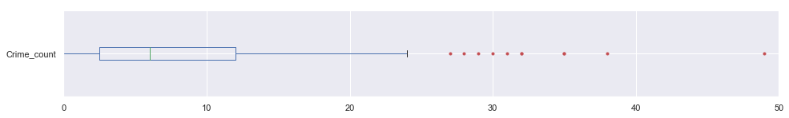


The target is crime. However, instead of just the count, it would be better to create a new column that will split the crime_count into high or not. Based on the graph above, 75% of violent crimes have a count of up to 12. If crime count is 12 or greater, I will consider it as a high crime count. Otherwise, the area would be considered not a high violent crime area.


```python
dc_data_df['High_crime'] = dc_data_df['Crime_count'].apply(lambda x: 1 if x >= 12 else 0)
dc_data_df.tail()
```


<div>
<style scoped>
    .dataframe tbody tr th:only-of-type {
        vertical-align: middle;
    }

    .dataframe tbody tr th {
        vertical-align: top;
    }

    .dataframe thead th {
        text-align: right;
    }
</style>
<table border="1" class="dataframe">
  <thead>
    <tr style="text-align: right;">
      <th></th>
      <th>index</th>
      <th>OBJECTID</th>
      <th>TRACT</th>
      <th>GEO</th>
      <th>GEOID2</th>
      <th>GEO_display_label</th>
      <th>Population</th>
      <th>Income</th>
      <th>Home_value</th>
      <th>No_car_percent</th>
      <th>Bachelor_or_higher</th>
      <th>Employment_percent</th>
      <th>Marital_percent</th>
      <th>Veterans_percent</th>
      <th>Crime_count</th>
      <th>High_crime</th>
    </tr>
  </thead>
  <tbody>
    <tr>
      <th>174</th>
      <td>174</td>
      <td>153</td>
      <td>10700</td>
      <td>1400000US11001010700</td>
      <td>11001010700</td>
      <td>Census Tract 107, District of Columbia, Distri...</td>
      <td>1711</td>
      <td>73750.0</td>
      <td>418400.0</td>
      <td>0.581</td>
      <td>0.8969</td>
      <td>0.757</td>
      <td>0.130</td>
      <td>0.012</td>
      <td>11.0</td>
      <td>0</td>
    </tr>
    <tr>
      <th>175</th>
      <td>175</td>
      <td>154</td>
      <td>10800</td>
      <td>1400000US11001010800</td>
      <td>11001010800</td>
      <td>Census Tract 108, District of Columbia, Distri...</td>
      <td>6451</td>
      <td>36058.0</td>
      <td>0.0</td>
      <td>0.882</td>
      <td>0.8321</td>
      <td>0.426</td>
      <td>0.026</td>
      <td>0.012</td>
      <td>1.0</td>
      <td>0</td>
    </tr>
    <tr>
      <th>176</th>
      <td>176</td>
      <td>155</td>
      <td>10900</td>
      <td>1400000US11001010900</td>
      <td>11001010900</td>
      <td>Census Tract 109, District of Columbia, Distri...</td>
      <td>4054</td>
      <td>31094.0</td>
      <td>0.0</td>
      <td>0.387</td>
      <td>0.1540</td>
      <td>0.558</td>
      <td>0.133</td>
      <td>0.042</td>
      <td>15.0</td>
      <td>1</td>
    </tr>
    <tr>
      <th>177</th>
      <td>177</td>
      <td>156</td>
      <td>11000</td>
      <td>1400000US11001011000</td>
      <td>11001011000</td>
      <td>Census Tract 110, District of Columbia, Distri...</td>
      <td>3720</td>
      <td>75529.0</td>
      <td>344900.0</td>
      <td>0.286</td>
      <td>0.8209</td>
      <td>0.721</td>
      <td>0.289</td>
      <td>0.109</td>
      <td>3.0</td>
      <td>0</td>
    </tr>
    <tr>
      <th>178</th>
      <td>178</td>
      <td>157</td>
      <td>11100</td>
      <td>1400000US11001011100</td>
      <td>11001011100</td>
      <td>Census Tract 111, District of Columbia, Distri...</td>
      <td>5548</td>
      <td>75781.0</td>
      <td>428700.0</td>
      <td>0.061</td>
      <td>0.3972</td>
      <td>0.572</td>
      <td>0.272</td>
      <td>0.062</td>
      <td>35.0</td>
      <td>1</td>
    </tr>
  </tbody>
</table>
</div>


Only two columns are objects and neither are relevant for my model, so I will just ignore them as appose to changing them to a category or one-hot-encoding.


```python
dc_data_df = dc_data_df.reset_index() # had to reset the index for my models to work

# features or X
features = dc_data_df[['Population', 'Income', 'Home_value', 'No_car_percent', 'Bachelor_or_higher', 'Employment_percent', 
                       'Marital_percent', 'Veterans_percent']]

# target or y
target = dc_data_df[['High_crime']]
```

### Machine Learning


```python
from sklearn.pipeline import Pipeline
from sklearn.preprocessing import StandardScaler
from sklearn.decomposition import PCA
from sklearn.model_selection import GridSearchCV
from sklearn.model_selection import train_test_split
from sklearn.metrics import mean_squared_error, r2_score
from sklearn import svm
from sklearn.ensemble import RandomForestClassifier
from sklearn import tree
from sklearn.neighbors import NearestNeighbors
from sklearn.neighbors  import KNeighborsClassifier
from sklearn.linear_model import LogisticRegression
from sklearn.exceptions import DataConversionWarning
import warnings
warnings.filterwarnings(action='ignore', category=DataConversionWarning)
warnings.filterwarnings('ignore')
```


```python
# split our data
X_train, X_test, y_train, y_test = train_test_split(features, target, test_size=0.2)

# scale data
sc = StandardScaler()
X_train = sc.fit_transform(X_train)
X_test  = sc.transform(X_test)
```

### Support Vector Machine: 81%


```python
# Create the pipeline for SVM
pipe_svm = Pipeline([('scl', StandardScaler()),
                     ('svm', svm.SVC(random_state=123))]);

# Create the grid parameter
grid_svm = [{'svm__kernel': ['poly', 'sigmoid'],
         'svm__C': [0.01, 1, 100],
         'svm__degree': [2,3,4,5],
         'svm__gamma': [0.001, 0.01]}];

# Create the grid, with "pipe" as the estimator
gridsearch_svm = GridSearchCV(estimator=pipe_svm,
                  param_grid=grid_svm,
                  scoring='accuracy',
                  cv=3);

# Fit using grid search
gridsearch_svm.fit(X_train, y_train);
best_parameters = gridsearch_svm.best_params_
best_score = gridsearch_svm.best_score_
print(best_parameters)
print(best_score)
```

    {'svm__C': 100, 'svm__degree': 2, 'svm__gamma': 0.001, 'svm__kernel': 'sigmoid'}
    0.8111888111888111
    

### Random Forest: 83%


```python
# Create the pipeline for Random Forest
pipe_rf = Pipeline([('scl', StandardScaler()),
                    ('clf', RandomForestClassifier(random_state=123))]);

# Create the grid parameter
grid_rf = [{'clf__n_estimators': [100, 120],
            'clf__criterion': ['entropy', 'gini'], 
            'clf__max_depth': [5, 8, 10],
            'clf__min_samples_leaf':[0.05, 0.1, 0.2],
            'clf__min_samples_split':[2, 3, 10]}];

# Create the grid, with "pipe" as the estimator
gridsearch_rf = GridSearchCV(estimator=pipe_rf,
                  param_grid=grid_rf,
                  scoring='accuracy',
                  cv=3);

# Fit using grid search
gridsearch_rf.fit(X_train, y_train);
best_parameters = gridsearch_rf.best_params_
best_score = gridsearch_rf.best_score_
print(best_parameters)
print(best_score)
```

    {'clf__criterion': 'entropy', 'clf__max_depth': 5, 'clf__min_samples_leaf': 0.2, 'clf__min_samples_split': 2, 'clf__n_estimators': 100}
    0.8251748251748252
    

### Decison Tree: 76%


```python
# Create the pipeline for Decison Tree
pipe_dt = Pipeline([('scl', StandardScaler()),
                    ('clf', tree.DecisionTreeClassifier(random_state=123))])

# Create the grid parameter
grid_dt = [{'clf__criterion': ['entropy', 'gini'], 
            'clf__max_depth': [5, 7, 10],
            'clf__min_samples_leaf':[0.05 ,0.1, 0.2],
            'clf__min_samples_split':[2, 5, 10]}]

# Create the grid, with "pipe" as the estimator
gridsearch_dt = GridSearchCV(estimator=pipe_dt,
                  param_grid=grid_dt,
                  scoring='accuracy',
                  cv=3)

# Fit using grid search
gridsearch_dt.fit(X_train, y_train);
best_parameters = gridsearch_dt.best_params_
best_score = gridsearch_dt.best_score_
print(best_parameters)
print(best_score)
```

    {'clf__criterion': 'entropy', 'clf__max_depth': 5, 'clf__min_samples_leaf': 0.05, 'clf__min_samples_split': 2}
    0.7622377622377622
    

### K-nearest neighbor: 86%


```python
# Create the pipeline for kNN
pipe_knn = Pipeline([('scl', StandardScaler()),
                     ('clf', KNeighborsClassifier())])

# Create the grid parameter
grid_knn = [{'clf__n_neighbors': [3, 5, 7], 
            'clf__p': [1, 2],
            'clf__weights':['uniform', 'distance']}]

# Create the grid, with "pipe" as the estimator
gridsearch_knn = GridSearchCV(estimator=pipe_knn,
                  param_grid=grid_knn,
                  scoring='accuracy',
                  cv=3)

# Fit using grid search
gridsearch_knn.fit(X_train, y_train);
best_parameters = gridsearch_knn.best_params_
best_score = gridsearch_knn.best_score_
print(best_parameters)
print(best_score)
```

    {'clf__n_neighbors': 5, 'clf__p': 2, 'clf__weights': 'distance'}
    0.8601398601398601
    

### Logistic Regression: 81%


```python
# Create the pipeline for LR
pipe_lr = Pipeline([('scl', StandardScaler()),
                    ('clf', LogisticRegression())])

# Create the grid parameter
grid_lr = [{'clf__C': [0.8, 0.9, 1.0, 1.1], 
            'clf__penalty': ['l1', 'l2'],
            'clf__random_state':[1, 5, 10]}]

# Create the grid, with "pipe" as the estimator
gridsearch_lr = GridSearchCV(estimator=pipe_lr,
                  param_grid=grid_lr,
                  scoring='accuracy',
                  cv=3)

# Fit using grid search
gridsearch_lr.fit(X_train, y_train);
best_parameters = gridsearch_lr.best_params_
best_score = gridsearch_lr.best_score_
print(best_parameters)
print(best_score)
```

    {'clf__C': 0.8, 'clf__penalty': 'l2', 'clf__random_state': 1}
    0.8111888111888111
    

From the models tested, Knn had the highest accuracy: 86%. Let's plot a confusion matrix to describe the performance of the model.


```python
#copied confusion matrix plotting function from the sklearn documentation:
#http://scikit-learn.org/stable/auto_examples/model_selection/plot_confusion_matrix.html
from sklearn.metrics import confusion_matrix
import itertools
def plot_confusion_matrix(cm, classes,
                          normalize=False,
                          title='Confusion matrix',
                          cmap=plt.cm.Blues):
    """
    This function prints and plots the confusion matrix.
    Normalization can be applied by setting `normalize=True`.
    """
    plt.imshow(cm, interpolation='nearest', cmap=cmap)
    plt.title(title)
    plt.colorbar()
    tick_marks = np.arange(len(classes))
    plt.xticks(tick_marks, classes, rotation=45)
    plt.yticks(tick_marks, classes)

    if normalize:
        cm = cm.astype('float') / cm.sum(axis=1)[:, np.newaxis]

    thresh = cm.max() / 2.
    for i, j in itertools.product(range(cm.shape[0]), range(cm.shape[1])):
        plt.text(j, i, cm[i, j],
                 horizontalalignment="center",
                 color="white" if cm[i, j] > thresh else "black")

    plt.tight_layout()
    plt.ylabel('True label')
    plt.xlabel('Predicted label')

class_names = ['Success','Failure']
```


```python
knn = KNeighborsClassifier()
knn.fit(X_train, y_train)
y_pred = knn.predict(X_test)

#confusion matrix for knn
cm = confusion_matrix(y_test,y_pred)
plot_confusion_matrix(cm, classes=class_names, title='Confusion matrix')
```


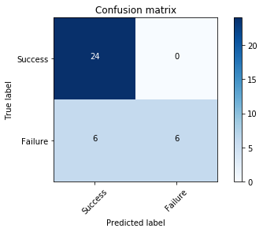


Now I understand that we only have a total of 36 predictions, but since I was only analyzing violent gun-related crimes from 2017 and split the crime count to either "high crime" or not, this will have to do. Here is what the confusion matrix is describing:

- a total of 36 predictions were made
- out of 36 predictions, the model predicted "Yes" 30 times and "No" 6 times
- the correct count is 24 "Yes" and "12" no

Calcualted rates:
- Accuracy: (24+6)/36 = 0.83
- Missclassification (Error Rate): (6+0)/36 = 0.16
- True positive rate (Sensetivity): 24/30 = 0.80
- False positive rate: 0/6 = 0
- True negative rate: 6/12 = 0.50
- Precision: 24/30 = 0.80

## Feature importance


```python
from sklearn.ensemble import ExtraTreesClassifier
model = ExtraTreesClassifier()
model.fit(features, target)
print(model.feature_importances_) #use inbuilt class feature_importances of tree based classifiers
#plot graph of feature importances for better visualization
feat_importances = pd.Series(model.feature_importances_, index=features.columns)
feat_importances.nlargest(10).sort_values().plot(kind='barh')
plt.show()
```

    [0.09633237 0.13005895 0.13089951 0.10759032 0.19712701 0.09475022
     0.15120362 0.09203801]
    


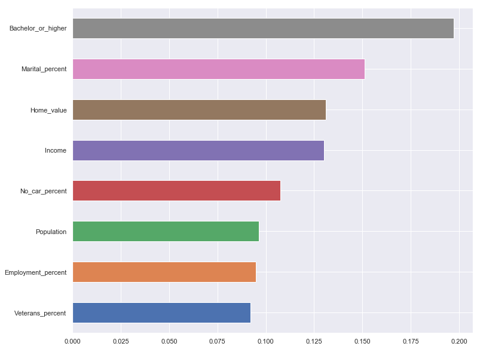


From the graph, we see that the three most important features are education, marital status, and income.

Just a few things to note about how to to build the map:
- convert the shapefile to geopandas
- save it as a json file
- create a variable which holds the json info `json(open('filename.json'))`
- used an online json viewer to understand the structor 
- noticed that `feature.id` was 0, 1, 2...
- need to change it to the `geoid` value
- ran a for loop to replace the `feature.id` to `properties.id`
- changed the column in my csv data file from int to str. in my json file, the `feature.id` was a str. in my csv file, the geoid column was int. both of these columns need to match in order for `key_on` to work
- note, i could have just changed the data type of the csv 17value column to str and then keyed it to `properties.GEOID` which would have worked as well

Links to research:

- [US Census](https://www.census.gov/)
- https://election.princeton.edu/wp-content/uploads/2013/01/violence_lead_Nevin.pdf 
- https://www.nij.gov/topics/crime/violent/pages/welcome.aspx 
- https://journalistsresource.org/studies/economics/real-estate/the-impact-of-crime-on-property-values-research-roundup/
- https://www.washingtonpost.com/realestate/beyond-wants-and-needs-flexibility-is-key-for-first-time-home-buyers/2018/01/29/8a496516-d5ec-11e7-b62d-d9345ced896d_story.html?utm_term=.3c7845e14e5c
- https://www.researchgate.net/publication/320173377_IMPACT_OF_CRIME_ON_PROPERTY_VALUES_LITERATURE_SURVEY_AND_RESEARCH_GAP_IDENTIFICATION


```python
!jupyter nbconvert --to markdown Choropleth_map.ipynb
!mv Choropleth_map.md README.md
```

    [NbConvertApp] Converting notebook Choropleth_map.ipynb to markdown
    [NbConvertApp] Support files will be in Choropleth_map_files\
    [NbConvertApp] Making directory Choropleth_map_files
    [NbConvertApp] Making directory Choropleth_map_files
    [NbConvertApp] Making directory Choropleth_map_files
    [NbConvertApp] Making directory Choropleth_map_files
    [NbConvertApp] Making directory Choropleth_map_files
    [NbConvertApp] Making directory Choropleth_map_files
    [NbConvertApp] Making directory Choropleth_map_files
    [NbConvertApp] Making directory Choropleth_map_files
    [NbConvertApp] Making directory Choropleth_map_files
    [NbConvertApp] Making directory Choropleth_map_files
    [NbConvertApp] Making directory Choropleth_map_files
    [NbConvertApp] Making directory Choropleth_map_files
    [NbConvertApp] Making directory Choropleth_map_files
    [NbConvertApp] Making directory Choropleth_map_files
    [NbConvertApp] Making directory Choropleth_map_files
    [NbConvertApp] Writing 57772 bytes to Choropleth_map.md
    


```python

```
